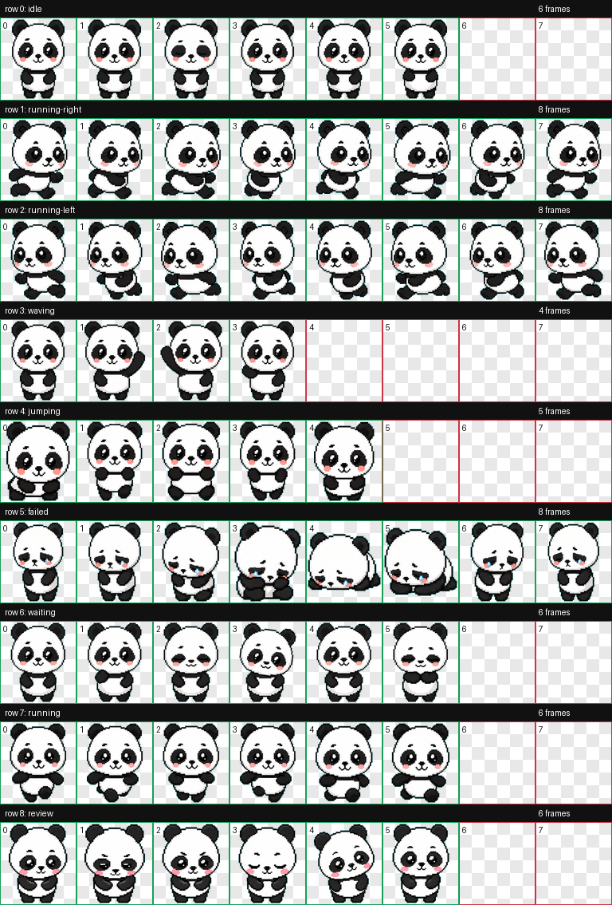

# Panda Pet

An open-source custom Codex pet: a soft, healing animated panda.



## Personality

Panda v0.2 is designed to feel quiet, warm, and comforting while you code. It keeps the same tiny panda identity, then softens the animation set with gentle breathing, sleepy blinks, small paw gestures, patient waiting, and calm review poses.

## Try It

```bash
git clone https://github.com/Jason-Bai/pet.git
cd pet
mkdir -p ~/.codex/pets
cp -R pets/panda ~/.codex/pets/
```

Then open Codex settings, go to Appearance > Pets, refresh the pet list if needed, and select `Panda`.

If Codex is already running, use Force Reload Skills / reload Codex App if the pet does not appear immediately.

## Files

- `pets/panda/pet.json` - Codex pet manifest.
- `pets/panda/spritesheet.webp` - 8x9 animated pet atlas.
- `preview/contact-sheet.png` - generated QA contact sheet for quick review.
- `preview/validation.json` - atlas validation output.

## Goal

This repository packages a cute panda Codex pet so other people can clone it, install it locally, and use it as their Codex App companion.

## Build Notes

This pet was generated with OpenAI's `hatch-pet` Codex skill. The final package was validated as a Codex-compatible RGBA WebP spritesheet.

Codex custom pet manifests currently expose the pet identity and spritesheet path. Panda v0.2 does not depend on custom hover, click, or petting APIs; the softer feel comes from the existing Codex pet animation states.
